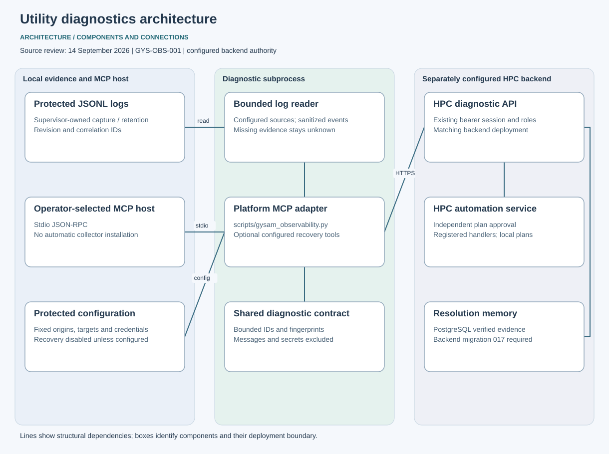

# testrepo

Last source review: **2026-09-14**, default branch `main`, commit [`89795c0961a9`](https://github.com/mmurugayen/testrepo/commit/89795c0961a9feb3fa4e4a2c63018b39fa1a86da). This records a documentation review of the linked source snapshot.

This repository contains a standalone Python diagnostic/MCP utility and repository test material. It does not currently define a deployable domain product or Terraform infrastructure. The diagnostic utility reads operator-configured logs; optional recovery uses a separately deployed, compatible HPC backend.



[Component architecture](docs/current/ARCHITECTURE.md) · [Investigation and recovery workflow](docs/current/WORKFLOWS.md) · [Documentation audit](docs/current/DOCUMENTATION_AUDIT.md)

## Run the diagnostic utility

Use Python 3.11 or later. Copy `config/observability-mcp.example.json` to a local configuration and supply explicit log paths. Run:

```bash
python3 scripts/gysam_observability.py --config /absolute/path/config.json
```

MCP stdout carries JSON-RPC; capture application diagnostics separately. Read [configuration, limits and optional recovery](docs/OBSERVABILITY_MCP.md) before configuring backend credentials or target aliases. Recovery is gated by the configured backend, registered runbooks and independent approval. There is no implicit application deployment, cloud provisioning or automatic repair.

## Check the source

```bash
python3 -m unittest discover -s tests -v
python3 scripts/check_observability_coverage.py
```

[Observability CI](.github/workflows/observability.yml) runs the utility contracts. [Feature acceptance](docs/product/backlog/GYS-OBS-001.md) tracks scope; [documentation validation](docs/current/VALIDATION.md) records checks actually run for this update.

Current guide maintenance: the [documentation audit](docs/current/DOCUMENTATION_AUDIT.md) records source revisions and historical-document status. Validate editable diagrams with `python3 docs/current/diagrams/render.py --check`.

[September 2026 source and CI audit](docs/validation/repository-audit-2026-09-19.md) records portable test results and outstanding qualification gates.
