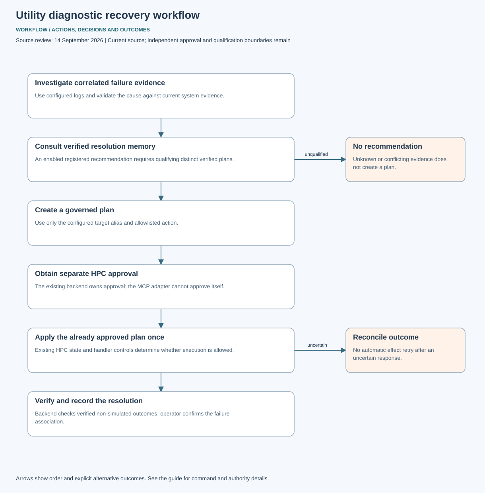

# testrepo: diagnostic workflow

Search configured logs by correlation identifier, inspect truncated/unavailable evidence, and investigate qualified fingerprints. An optional compatible HPC backend can retrieve verified resolution examples. A matching registered action must be proposed and independently approved before a single apply attempt. Unknown outcomes require reconciliation. Learning requires server-verified plan outcomes and a matching local failure; it does not grant execution authority or retry effects automatically.

[Architecture](ARCHITECTURE.md) · [Tool arguments and operational limits](../OBSERVABILITY_MCP.md)
